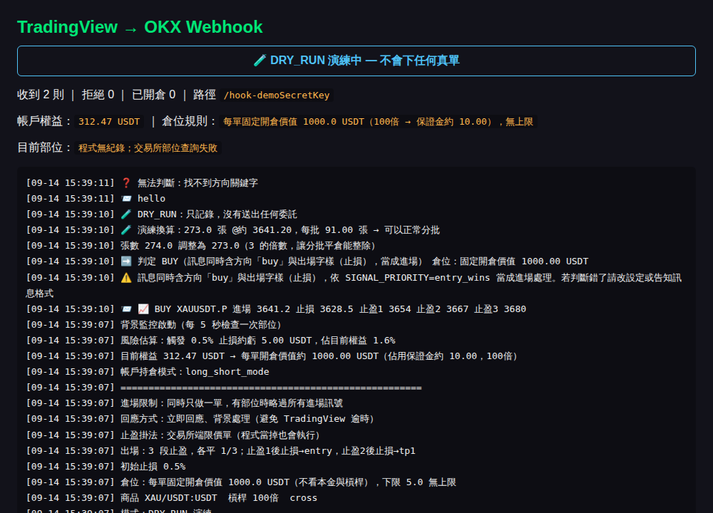

# okx-webhook — TradingView → OKX signal-driven perpetual futures bot

[繁體中文在下方 ↓](#繁體中文)

A small, production-tested bridge that turns TradingView alerts into fully managed
OKX perpetual-futures trades: market entry, exchange-side stop-loss, three
reduce-only take-profit orders, and automatic stop-loss trailing as each TP fills.

Running with real (small) money since **August 2026**. Single file, no database,
no cloud account required — runs on a normal Windows/Linux PC behind a
`cloudflared` tunnel.



## What it does

```
TradingView indicator (FVG / iFVG / BOS structure)
        │  alert() fires; message carries direction, stop-loss and 3 TP prices
        ▼
HTTPS webhook  ◄── cloudflared tunnel, secret embedded in the URL path
        ▼
Local Flask service ── live dashboard (position state, order log)
        │  ccxt
        ▼
OKX API
   ├─ market entry (fixed notional per trade, e.g. 1 000 USDT)
   ├─ stop-loss placed as a separate conditional order
   └─ 3 × reduce-only limit take-profits, 1/3 of the position each
```

**Exit management runs on the exchange, not on the PC.** The take-profit orders
are resting on OKX from the moment the position opens, so a crashed script,
a dropped tunnel or a rebooted computer cannot leave a position without exits.
The script's only remaining job is to move the stop:

| Event | Action |
|---|---|
| TP1 fills | stop-loss → entry price (break-even) |
| TP2 fills | stop-loss → TP1 price |
| TP3 fills | flat |

## Why this is not a 50-line webhook script

The interesting part is the failure handling — every item below was found on a
live account, not in a tutorial.

- **Secret in the URL path, not the body.** TradingView's "Any alert() function
  call" mode sends only the text the indicator generates; the message box is
  ignored. The only reliable auth channel is the path (`/hook-<secret>`).
- **Reply first, trade later.** TradingView times out a webhook after ~3 s; one
  entry needs 7–8 round-trips to OKX. The endpoint returns `200` immediately and
  hands the work to a background thread.
- **Stop-loss must be a separate order** on OKX hedge-mode accounts — attaching
  it to the market order gets the *whole* order rejected with error `51278`.
  If the stop cannot be placed after entry, the position is closed immediately
  rather than left naked.
- **Survives restarts.** On start-up the bot reads open positions and resting
  orders from OKX and rebuilds its state (entry price, initial size, which TPs
  have filled) so a restart mid-trade never leaves an unmanaged position and
  never blocks new signals forever.
- **Guard rails:** hard notional cap, max margin-% of equity, max orders per
  hour, 20-second duplicate-signal window, signal stop-loss sanity check
  (direction + max distance), size rounded *down* to a multiple of the TP split,
  one trade at a time.
- **DRY_RUN mode** logs the full decision path (parsed direction, sizing,
  contract rounding, risk in USDT and % of equity) without sending a single
  order. Run it for a day against real alerts before flipping the switch.
- **Dashboard is local-only by default** — the tunnel is public, and the log
  contains the secret.

## Signal format

Plain-text alerts, keyword based, Chinese or English. An entry alert normally
carries everything at once:

```
BUY XAUUSDT.P 進場 3641.2 止損 3628.5 止盈1 3654 止盈2 3667 止盈3 3680
```

| Purpose | Recognised keywords (case-insensitive) |
|---|---|
| Long | `buy`, `long`, `bullish`, `bos↑`, 做多, 買入, 多單 |
| Short | `sell`, `short`, `bearish`, `bos↓`, 做空, 賣出, 空單 |
| Take-profit event | `tp 1`, `take profit 2`, 止盈1 … |
| Flatten | `close all`, `exit`, `stop loss`, 平倉, 全平 |

Stop-loss and TP prices are parsed from the message; a percentage fallback is
used only when no stop price is present.

## Quick start

```bash
git clone https://github.com/ttnpiongx-bit/okx-webhook.git
cd okx-webhook
pip install -r requirements.txt
cp my_config.example.py my_config.py     # fill in keys, keep DRY_RUN = True
python okx_webhook_bot.py
cloudflared tunnel --url http://127.0.0.1:8081   # use 127.0.0.1, not localhost, on Windows
```

Point the TradingView alert at
`https://<your-tunnel>.trycloudflare.com/hook-<WEBHOOK_SECRET>`,
open `http://127.0.0.1:8081` to watch it, and only set `DRY_RUN = False`
after you have watched real alerts flow through correctly.

`my_config.py` is git-ignored; anything in it overrides the defaults in the
main file, so pulling updates never clobbers your keys.

## Tech

Python 3.10+ · Flask · ccxt · cloudflared. Tested on OKX `XAU/USDT:USDT`
perpetual (contract size 0.001 oz, integer contracts). Other USDT-margined
perpetuals need only a `SYMBOL` change; other exchanges need the ccxt id and a
check of their stop-order parameters.

## Status

Live with a small account since 2026-08; still being tuned. This is a personal
project and a learning log, not a product.

## Disclaimer

Not investment advice. Leveraged derivatives can lose the entire account.
Anything you trade with this code is on you. The author is not a licensed
investment adviser.

## License

MIT

---

<a name="繁體中文"></a>
# 繁體中文

TradingView 訊號驅動的 OKX 永續合約自動交易系統。
指標發出警報 → 本機 Flask 服務接收驗證 → 直接在 OKX 市價開倉、單獨掛停損、
三張 reduce-only 限價停利，並在每段停利成交後自動把停損往上搬。

2026 年 8 月起以小額實單運行中。單一檔案、不需要資料庫、不需要雲端主機，
一台 Windows/Linux 電腦加 cloudflared 隧道就能跑。

## 系統架構

```
TradingView 指標（FVG / iFVG / BOS 結構偵測）
        │ alert() 觸發，訊息含進場方向、停損價、三個停利價
        ▼
webhook (HTTPS) ◄── cloudflared 隧道，密鑰放在網址路徑
        ▼
本機 Flask 服務 ── 控制台（部位狀態、下單紀錄）
        │ ccxt
        ▼
OKX API
   ├─ 市價開倉（每單固定開倉價值）
   ├─ 停損單（獨立掛出）
   └─ 三張 reduce-only 限價停利單，各 1/3
```

## 交易邏輯

**進場**：由 TradingView 訊號觸發；固定開倉價值，不依帳戶餘額浮動；
同時只持有一單，有部位時忽略新訊號。

**出場**：三段停利各平 1/3，開倉時就掛到交易所端，不依賴本機程式持續運行。
停利 1 成交 → 停損移到開倉價（保本）；停利 2 成交 → 停損移到停利 1 價位。

## 踩過的坑（這個專案最有價值的部分，都是實單撞出來的）

1. **TradingView 的 alert 訊息欄位不會送出。** 用「任何 alert() 函數呼叫」時，
   送出的是指標自己產生的文字，訊息欄位填什麼都沒用。→ 密鑰必須放在網址路徑
   `/hook-<密鑰>`。
2. **OKX 雙向持倉模式下，停損不能綁在市價單上。** 會被 `51278` 退回整筆委託。
   → 先開倉，成交後再單獨掛停損；掛不上就立刻平倉，不留裸單。
3. **Windows 上 cloudflared 要指定 IPv4。** `localhost` 會走 IPv6 連不到，
   要用 `127.0.0.1`。
4. **TradingView webhook 只等 3 秒。** 一次進場要跟 OKX 往返七八次。
   → 收到訊號立即回 200，下單邏輯丟背景執行緒。
5. **程式重啟時手上有倉怎麼辦。** 啟動時從交易所讀回部位與未成交委託，
   把開倉價、初始張數、已成交的停利段數拼回來，才不會有一筆單沒人管，
   也不會永遠擋住新訊號。

## 安全設計

- 名目金額絕對上限、保證金佔權益上限、每小時最大下單數
- 20 秒內重複訊號只執行一次
- 訊號帶的停損價會驗證方向與距離，抓錯數字就不採信
- 張數往下取整到停利分批的倍數，曝險只會變小
- `DRY_RUN` 模式完整記錄判斷過程但不送任何委託，先跑一天再上實單
- 控制台預設只開放本機，隧道是公開的、日誌裡有密鑰

## 安裝

```bash
pip install -r requirements.txt
cp my_config.example.py my_config.py      # 填金鑰，DRY_RUN 先保持 True
python okx_webhook_bot.py
cloudflared tunnel --url http://127.0.0.1:8081
```

`my_config.py` 已列入 `.gitignore`，裡面的設定會覆蓋主程式預設值，
更新主程式不會蓋掉你的金鑰。

## ⚠️ 免責聲明

本專案為個人技術實作與學習紀錄，不構成任何投資建議或買賣推薦，不保證獲利。
高槓桿合約交易風險極高，可能導致本金全部損失；使用本程式碼產生之交易結果由使用者自行承擔。
作者非證券投資顧問事業，不提供投資顧問服務。
